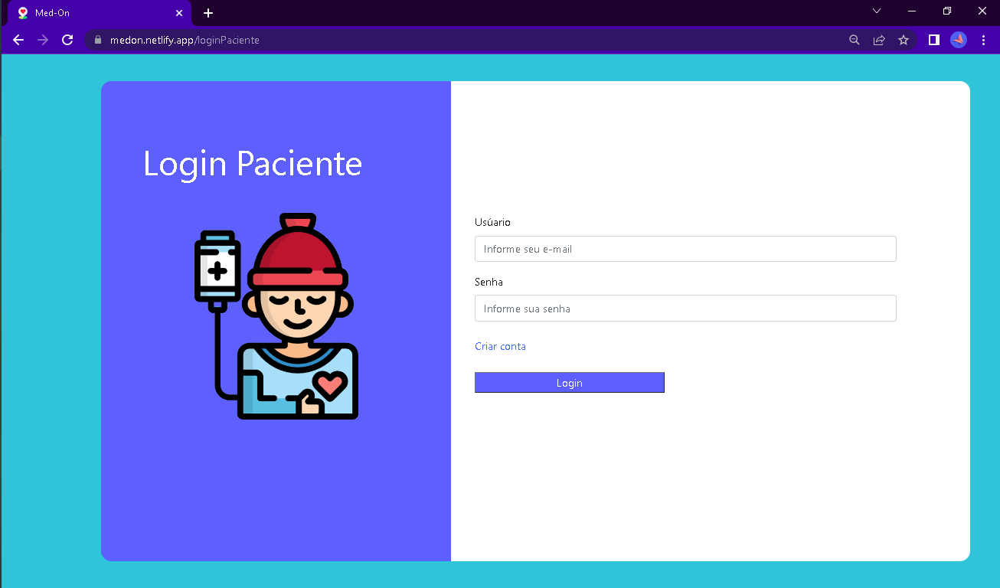
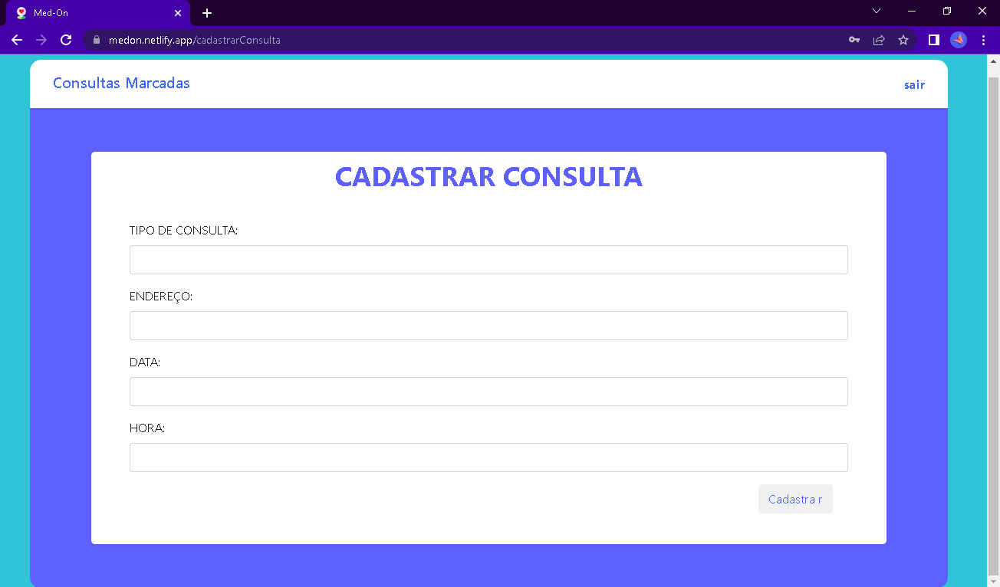
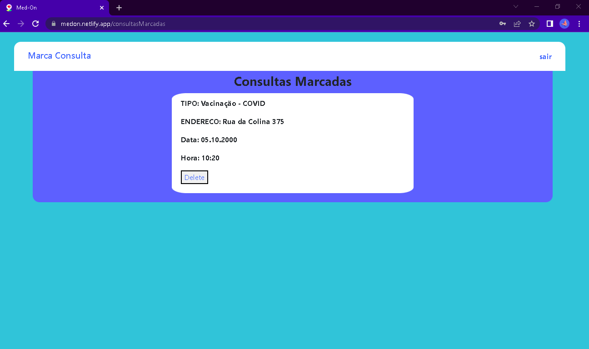

# Projeto realizado para cadeira de Engenharia de Software I

Projeto criado no intuito de criar uma aplicação web voltado para serviços medicos , onde um paciente poderar marcar qualquer tipo de consulta ou exame para ser atendido por um medico em sua residencia

## Telas

  

  <h4>Login medico</h4>
  
  <h4>Login Paciente</h4>
    
  <h4> Cadastrar Consulta Medica</h4>
    
  <h4>Consultas Marcadas do Medico/Paciente</h4>
    

## Instalação

### Cliente

1. `$ cd client`
2. `$ npm install` or `$ yarn install`
3. `$ npm install axios bootstrap formik react react-bootstrap react-dom react-router-dom react-scripts web-vitals yup`
4. `$ npm start` or `$ yarn start`

### Servidor

1. `$ cd server`
2. `$ npm install` or `$ yarn`
3. `$ npm install bcryptjs cors express mysql2 nodemon react-router-dom`
4. `$ npm rum devStart`

## Funcionalidades

- Registra usuarios paciente/medico com senha criptografada.
- Checagem de resgitro para o mesmo usuario não se cadastrar duas vezes.
- Verificação de e-mail e senha criptografada para login
- Cadastro de consulta medica , para o paceinte receber atendiemento home-care
- Verificação de quais e quantas consultas foram cadastradas
- Remoçao de consulta cadastrada , caso o paciente tenha digitado algum campo de forma incorreta
- Desmarcação de consulta , caso o Medico deseje rejeitar alguma consulta marcada pelo paciente

## Bibliotecas Usadas

### Front-end
- `React JS`
- `Bootstrap`
- `CSS`
- `formik`
- `yup`
- `axios`

### Back-end

- `Node JS`
- `bcryptjs `
- `express`
- `mysql`
- `nodemon`
